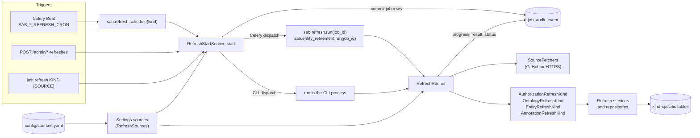
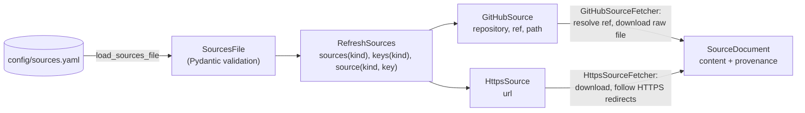
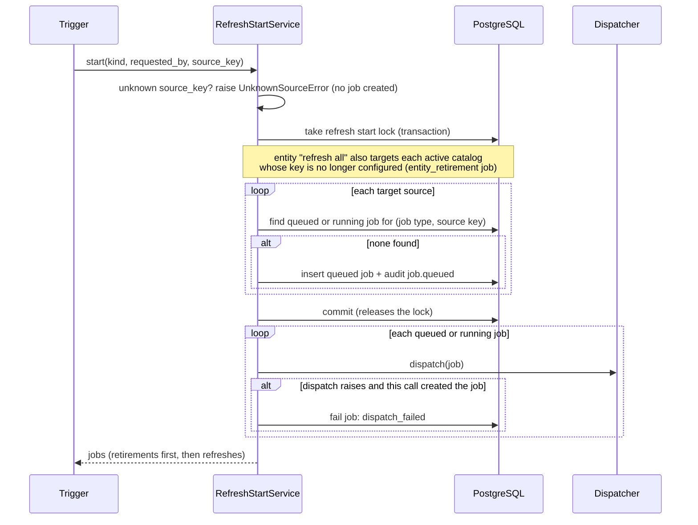
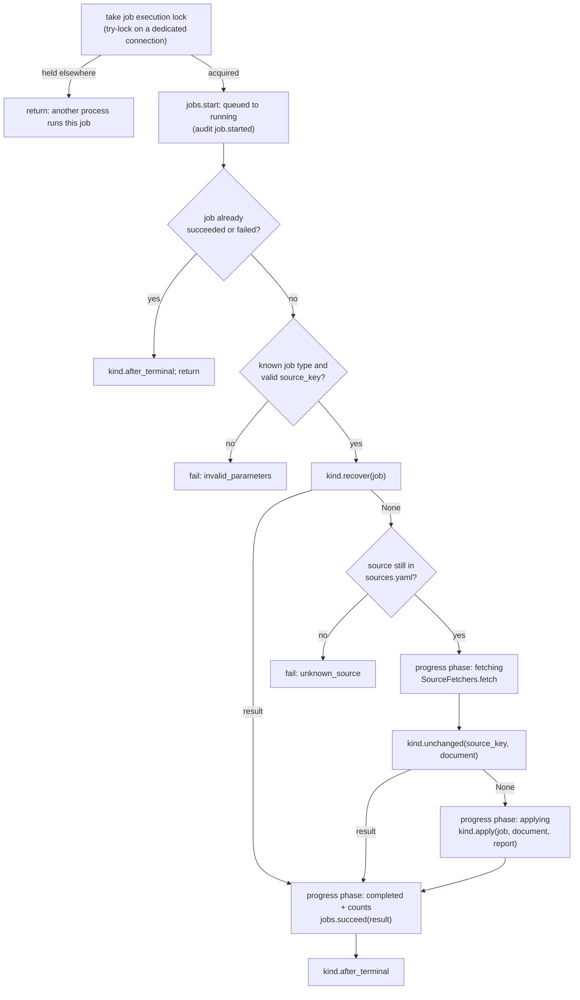
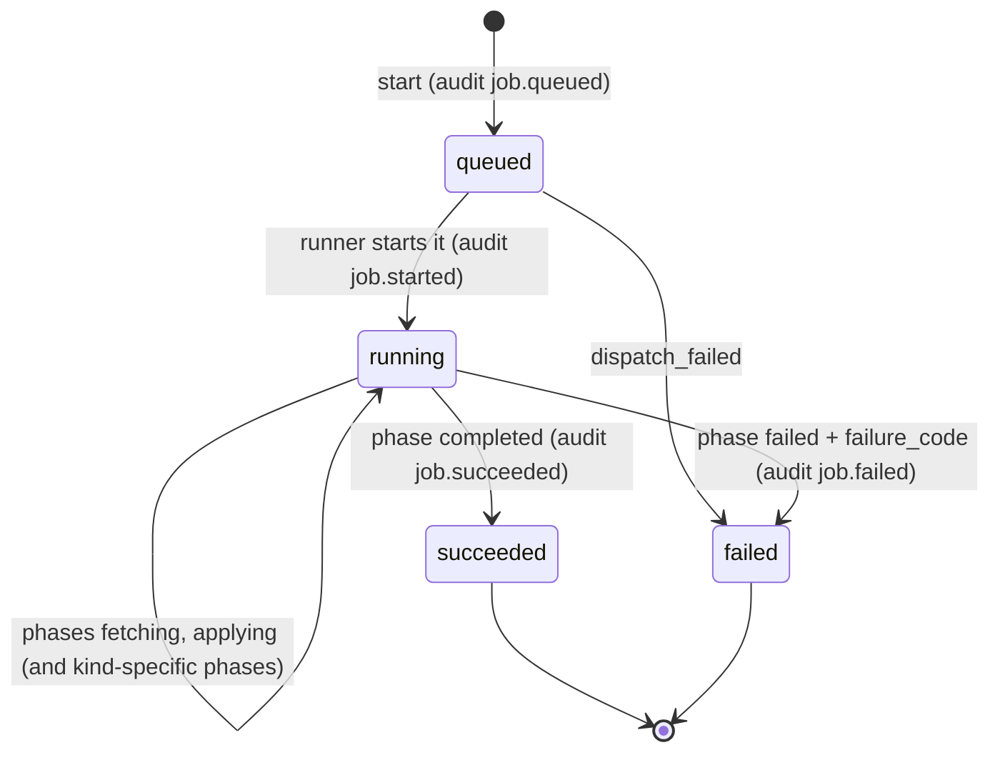

# Refresh infrastructure guide

This guide is for developers changing or debugging reference data refreshes.
`ARCHITECTURE.md` describes the design at a high level, and docstrings describe
each piece. This guide connects the two. It follows a refresh from the moment
something starts it, through the job that runs it, to the rows it writes in
PostgreSQL.

SAB refreshes four kinds of reference data:

| Kind | Source format | Configured in `config/sources.yaml` | Source keys |
|---|---|---|---|
| `authorization` | go-site `users.yaml` | `authorization` (one entry) | always `go-site` |
| `ontology` | OBO | `ontologies` | ontology keys, such as `go` |
| `entity` | GPI 2.0 | `entities` | any key matching `^[a-z0-9][a-z0-9_-]*$` |
| `annotation` | GPAD 2.0 | `annotations` (each entry names the `group` it replaces) | any key matching `^[a-z0-9][a-z0-9_-]*$` |

The annotation kind has two job types, `annotation_refresh` and
`annotation_cutover`, both served by `AnnotationRefreshKind`. A cutover is a
final replacement that moves the group to SAB management. It starts only from
the admin API, through `RefreshStartService.start_cutover`.

## The whole picture

Every refresh, however it starts, goes through the same two services:
`RefreshStartService` creates jobs, and `RefreshRunner` runs them. The runner
handles the steps every kind shares and calls a *kind* object for the steps
that differ.

Two rules shape everything else:

- **Jobs store only a source key.** A job's parameters are always
  `{"source_key": "<key>"}`. The runner looks the source up in the sources file
  when the job runs, not when it was created. A source removed from the file
  before its job runs fails with `unknown_source` and is never fetched.
- **Everything is safe to repeat.** Celery can deliver a task message more than
  once. A start can find a job already queued. A job can run again after its
  worker stopped partway. Each step checks what is already committed before
  doing new work.

## Inputs: `config/sources.yaml`

`Settings` reads the file when it is constructed (`SAB_SOURCES_FILE`, default
`config/sources.yaml`). An invalid file stops the API, worker, scheduler, and CLI
at startup. The models live in `refresh/sources.py`:

A `SourceDocument` carries the downloaded bytes and their provenance:
`source_type`, `source_locator` (`github:<repository>:<path>` or the URL),
`source_revision` (the resolved commit, or `None` for HTTPS), `source_checksum`
(SHA-256 of the downloaded bytes), and `fetched_at`. Every kind stores these
fields on the record it creates, and every kind uses them to decide whether a
document is already active.

## Starting a refresh

| Trigger | Entry point | `requested_by` | How jobs are dispatched |
|---|---|---|---|
| Schedule | Beat entries `authorization-refresh`, `ontology-refresh`, `entity-refresh`, `annotation-refresh` call `sab.refresh.schedule(kind)` in `workers/tasks.py` | `scheduler` | Celery (`tasks.dispatch_refresh_job`) |
| API | `api/routes/admin.py` | the caller's actor ID | Celery (`tasks.dispatch_refresh_job`) |
| CLI | `cli/refresh.py` (`just refresh`) | `cli` | in the CLI process, one job at a time |

All three triggers call `RefreshStartService.start(kind, requested_by=..., source_key=...)`.
A `source_key` refreshes one source; `None` refreshes every configured source of
the kind. The authorization route and CLI never pass a key, because there is
only one authorization source. For annotations, "refresh all" leaves out groups
that are SAB-managed, and naming a SAB-managed group's source raises
`GroupSabManagedError` (`group_sab_managed`, HTTP 409) before any job is created.
Cutovers use a separate entry point, `RefreshStartService.start_cutover`, which
the `POST /admin/annotation-cutovers` route calls. The schedule and CLI never
start cutovers.

Points worth knowing when something looks wrong:

- **Reuse.** A start never creates a second unfinished job for the same source.
  It returns the existing one and dispatches it again. That is how a job whose
  worker disappeared gets resumed: any later start sends it again.
- **Commit before dispatch.** A worker must be able to read the job it is sent.
- **Dispatch failures.** Only a job created by this call is marked failed
  (`dispatch_failed`). A reused job may already be in the broker, so it is left
  as it is.
- **Routing.** `tasks.dispatch_refresh_job` sends `entity_retirement` jobs to
  `sab.entity_retirement.run` and every other job to `sab.refresh.run`. Celery
  messages carry only the job ID.

## Running a job

`RefreshRunner.run(job_id)` in `refresh/runner.py` is the same for every kind.
The Celery task `sab.refresh.run` and the CLI both call it.

Any exception raised after the job has started is classified:

| Error | Outcome |
|---|---|
| `SourceError` (from fetching or decoding) | job fails with its code: `timeout`, `http_status`, `source_error`, `invalid_gzip`, `invalid_utf8` |
| `UnknownSourceError` | job fails with `unknown_source` |
| `TerminalRefreshError` (raised by a kind) | job fails with its code and `failure_details` |
| an exception listed in `kind.terminal_errors` | job fails with the mapped code |
| anything else | re-raised; the job stays `running` with its committed work |

A failed job is recorded by `kind.fail`, which calls `JobService.fail_refresh`.
In one transaction it sets the status, stores
`{"phase": "failed", "failure_code": ..., "failure_details"?: ...}` as progress,
writes the `job.failed` audit event, and runs any kind-specific cleanup.

A re-raised error means "try again later". Celery's wrapper
(`_retry_safely` in `workers/tasks.py`) logs only the exception type and retries
after 30 seconds. The CLI logs it and reports the job as still `running`. The
next start for that source reuses the job and runs it again, and `recover` picks
up whatever the earlier attempt committed.

### The job record over time

Kinds may report their own phases inside `applying`. Entity refreshes report
`staging` and then `publishing`. When nothing was applied because the document
was already active, completed progress includes `"unchanged": true`.

## What each kind does

Each kind implements the `RefreshKind` protocol in `refresh/kinds.py`. Read the
rows below side by side: the steps are the same, and only their contents differ.

| Step | Authorization (`refresh/authorization.py`) | Ontology (`refresh/ontology.py`) | Entity (`refresh/entity.py`) | Annotation (`refresh/annotation.py`) |
|---|---|---|---|---|
| `recover` | nothing to recover; the replacement is one transaction | stored `refresh_result` on this job's `ontology_metadata` row | stored publication result, or committed staging, which it publishes without fetching | stored publication result from this job's `annotation_import` row; unpublished staging is discarded and redone, not resumed |
| `unchanged` | most recent `authorization_refresh` row has the same type, locator, revision, and checksum | active `ontology_metadata` row has the same type, locator, revision, and checksum | active `entity_catalog_snapshot` has the same locator and checksum | ordinary refreshes only (a cutover never skips): the group is `gpad_imported`, its last published import has the same checksum and no `unknown_db_object_id` rejections, and the group has no local changes |
| `apply` | decode UTF-8, validate `users.yaml`, replace users and grants | take the ontology lock, check unchanged again, parse OBO, stage, activate | decode gzip and UTF-8, parse GPI, stage, publish | try the group lock, refuse a SAB-managed group, decode gzip and UTF-8, parse GPAD, stage, publish (replacing the group's annotations) |
| Tables written | `sab_user`, `sab_group`, `authorization_assignment`, `authorization_refresh` | `ontology_metadata`, `ontology_term`, `ontology_closure`; `annotation` and its versions when terms are replaced | `entity_catalog_snapshot`, `entity_staging_record`, `entity_membership`, `entity_source_record` | `annotation_staging` (and its multivalued and duplicate-reference child tables), `annotation_import`, `group_annotation_management`; on publication, the group's `annotation` rows and dependents are deleted and replaced |
| Audit action | `authorization.refreshed` | `ontology.refreshed`, plus `annotation.updated` per replaced term | `entity.refreshed` (`entity.retired` for retirement) | `annotation_refresh.published` or `annotation_cutover.published` |
| Kind-specific failure codes | `invalid_document` | `invalid_document`, `candidate_conflict` | `header`, `row_validation`, `catalog_collision`, `candidate_conflict` | `header`, `no_valid_annotations`, `cutover_rejected`, `group_sab_managed` |
| `fail` cleanup | none | none | deletes the job's staging rows | deletes the job's staging rows and unpublished `annotation_import` row |
| `after_terminal` | nothing | prune old snapshot data | nothing | nothing |

Some details that matter when debugging:

- **Authorization.** `AuthRepository.replace_authorizations` takes the
  authorization refresh lock and checks the most recent refresh again inside the
  same transaction. Two concurrent refreshes of the same document therefore apply
  it once. A redelivered job fetches again, finds its own committed refresh
  through `unchanged`, and succeeds with `applied: false`.
- **Ontology.** Staging and activation happen while the job holds the
  per-ontology lock (`ontology_refresh_lock`). If another process holds it,
  `apply` raises `OntologyRefreshBusyError`, which is not a classified failure,
  so the run is retried. Activation also takes the exclusive annotation
  system-update lock, because it may rewrite annotations. Pruning runs after
  every finished ontology job: through `sab.ontology.prune` under Celery, or
  directly in the CLI process, where a busy lock or a pruning error is logged and
  skipped.
- **Entity.** Staging and publication are separate transactions. If a worker
  stops between them, `recover` publishes the committed staging on the next run.
  Publication holds the per-source entity catalog lock. A "refresh all" request
  also creates an `entity_retirement` job for every active catalog whose source
  key is no longer configured. `RefreshRunner.run_retirement` runs it, and it does
  nothing if the key has been added back.

- **Annotation.** Publication replaces the target group's annotations, change
  sets, comments, and related audit events, and cannot be undone. Staging and
  publication are separate transactions. Publication takes the exclusive global
  annotation-write lock, so annotation writes wait until it commits. Rows whose
  `db_object_id` is not an active entity are rejected and reported; an ordinary
  refresh publishes the rest, and a cutover fails on any rejection.

## Locks

| Lock | Kind of lock | Held by | Prevents |
|---|---|---|---|
| Refresh start lock | transaction advisory lock | `RefreshStartService.start` | two starts both creating a job for the same source |
| Job execution lock | session try-lock, one per job | `RefreshRunner.run`, `run_retirement` | two processes running one job after a duplicate delivery |
| Authorization refresh lock | transaction advisory lock | `replace_authorizations` | concurrent authorization replacements |
| Ontology refresh lock | session try-lock, one per ontology | ontology `apply` and `prune` | out-of-order activation, and pruning a snapshot that is being activated |
| Entity catalog lock | transaction advisory lock, one per source | entity publish and retire | concurrent changes to one source's active catalog |
| Annotation system-update lock | exclusive global annotation-write lock | ontology activation and annotation publication | ordinary annotation writes during term replacement or group replacement |
| Annotation group lock (`annotation_group_lock`) | session try-lock, one per group | annotation `apply`, after the document is fetched and found changed | two GPAD jobs for one group staging or publishing at once |

The try-locks never wait. A process that cannot take one either returns (job
lock) or raises so the task is retried later (ontology lock and annotation group
lock, which raises `AnnotationRefreshBusyError`).

## Where to start

| Symptom or task | Look at |
|---|---|
| A job stays `running` | worker logs for `Worker task unavailable` (Celery retries) or `Refresh job stopped before finishing` (CLI); start the same refresh again to dispatch and resume it |
| A job failed | its `progress.failure_code` and `failure_details` through `GET /admin/jobs/{job_id}`; the table of classified errors above |
| `unknown_source` | the job's `source_key` against `config/sources.yaml` as loaded by the running process (settings are cached per process) |
| A refresh did nothing | completed progress with `"unchanged": true`: the source document is already active |
| A scheduled refresh never ran | `workers/celery_app.py` Beat entries and the `SAB_*_REFRESH_CRON` settings |
| Adding a source to an existing kind | `config/sources.yaml` only; no code change |
| Adding a source type | `refresh/sources.py` (model) and `refresh/fetchers.py` (fetcher) |
| Adding a refresh kind | a `RefreshKind` in `refresh/`, its job type and audit action in `domain/`, wiring in `workers/runtime.py`, a section in `config/sources.yaml`, a Beat entry, and an admin route |

## Tests

| Area | Tests |
|---|---|
| Sources file and fetchers | `tests/unit/test_sources_file.py`, `tests/unit/test_source_fetchers.py` |
| Shared lifecycle, run for every kind | `tests/integration/test_refresh_runner.py` (the `CASES` table) |
| Starting, reuse, dispatch, and concurrent starts | `tests/integration/test_refresh_start_service.py` |
| Kind-specific behavior | `tests/integration/test_*_refresh_jobs.py`, `test_*_refresh_service.py`, `test_*_refresh_concurrency.py`, `test_entity_catalog_retirement.py`, `test_users_yaml_sync.py` |
| Entry points | `tests/integration/test_admin_api.py`, `tests/integration/test_refresh_cli.py`, `tests/unit/test_worker_task_safety.py`, `tests/unit/test_celery_app.py` |

`tests/integration/refresh_helpers.py` provides `FakeFetchers`, which returns
fixed documents instead of using the network, and `build_runner`, which builds
the production runner and kinds around them.
